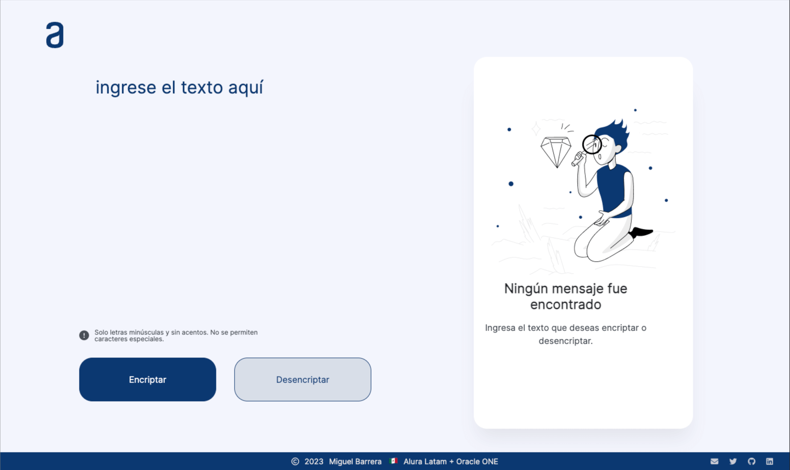
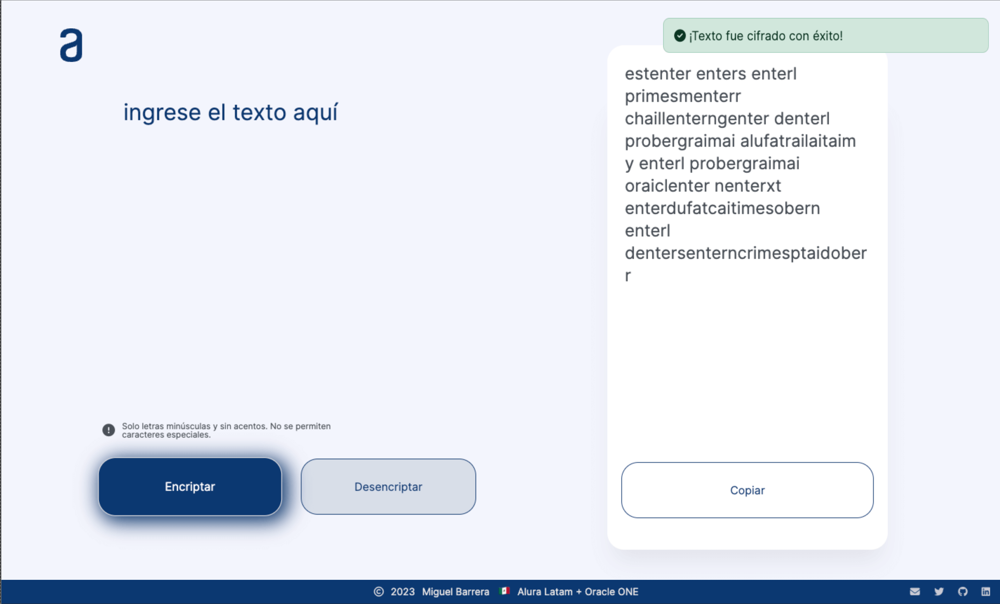

# AluraLatam + Oracle ONE

 
          

# Challenge ONE | Lógica de Programación | Encriptador de texto

Challenge I del grupo 4: **challengeonecodificador4**.

* 🧑🏽‍💻 Creado con las tecnologías básicas del FrontEnd: HTML, CSS y JavaScript.  
* 🚀 Cuenta con un diseño responsivo básico.  
* 🎯 También se implementó un pequeño sistema creado a mano de notificaciones para dar retroalimentación a las acciones ejecutadas por el usuario al hacer click en los botones disponibles.  

  
* ⌨️ Escribe cualquier texto para encriptarlo o desencriptarlo.  
* 📚 Solo permite escribir en minúsculas y no permite el uso de caracteres especiales.  
 

 
     &nbsp; &nbsp;
    

  * 📱 QR para acceder directamente desde móviles.

 
    

